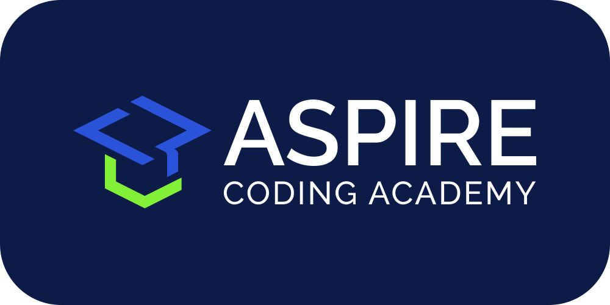

<!-- PROJECT LOGO -->
 

  
   
  <h1 align="center">blog</h1>

  
Standalone blog posts

<!-- TABLE OF CONTENTS -->

  
Table of Contents

  <ol>
    <li><a href="#about">About</a></li>
    <li><a href="#usage">Usage</a></li>
    <li><a href="#built-with">Built With</a></li>
    <li><a href="#contributing">Contributing</a></li>
    <li><a href="#license">License</a></li>
    <li><a href="#contact">Contact</a></li>
    <li><a href="#acknowledgments">Acknowledgments</a></li>
  </ol>

## About

This repository is part of [Aspire Coding Academy][aspirecodingacademy-url]'s [WIP Initiative][wip-initiative-url].

This repository contains our standalone blogs. Blogs can easily become part of the great noise that is the explosion of content in this generation. We position our blogs as succinct, digestible content to be referenced within structured instruction contexts.

## Usage

Blogs are titled `YYYYMMDD_TITLE.md`, with `YYYYMMDD` being the original publish date.

## Built With

[![Markdown][markdown-shield]][markdown-url]

## Contributing

Thank you for your interest in contributing to this project. Open source projects are a beautiful picture of collaboration and generosity. Please raise items for discussion using the links below, via a pull request, or by email.

[Request Feature][feature-request-url] 
[Report Bug][bug-report-url]

## License

[![License][license-shield]][license-url]

## Contact

[contact@aspirecodingacademy.com](mailto:hello@aspirecodingacademy.com)

## Acknowledgments

-   [othneildrew/Best-README-Template][readme-template-url]
    -   For the README template

<!-- MARKDOWN LINKS -->
<!-- https://www.markdownguide.org/basic-syntax/#reference-style-links -->

<!-- aca -->

[aspirecodingacademy-url]: https://aspirecodingacademy.com
[wip-initiative-url]: https://github.com/aspirecodingacademy/wip-initiative

<!-- repo -->

[feature-request-url]: https://github.com/aspirecodingacademy/blog/issues/new?labels=enhancement&template=feature-request---.md
[bug-report-url]: https://github.com/aspirecodingacademy/blog/issues/new?labels=bug&template=bug-report---.md

<!-- about -->

[product-screenshot]: readme-assets/screenshot.png

<!-- usage -->

[usage-screenshot]: readme-assets/screenshot.png

<!-- built_with -->

[python-shield]: https://img.shields.io/badge/python-3670A0?style=for-the-badge&logo=python&logoColor=ffdd54
[python-url]: https://python.org/
[react-shield]: https://img.shields.io/badge/React-20232A?style=for-the-badge&logo=react&logoColor=61DAFB
[react-url]: https://reactjs.org/
[markdown-shield]: https://img.shields.io/badge/markdown-%23000000.svg?style=for-the-badge&logo=markdown&logoColor=white
[markdown-url]: https://www.markdownguide.org/

<!-- license -->

[license-shield]: https://img.shields.io/github/license/aspirecodingacademy/blog.svg?style=for-the-badge
[license-url]: https://github.com/aspirecodingacademy/blog/blob/master/LICENSE.txt

<!-- acknowledgements -->

[readme-template-url]: https://github.com/othneildrew/Best-README-Template
