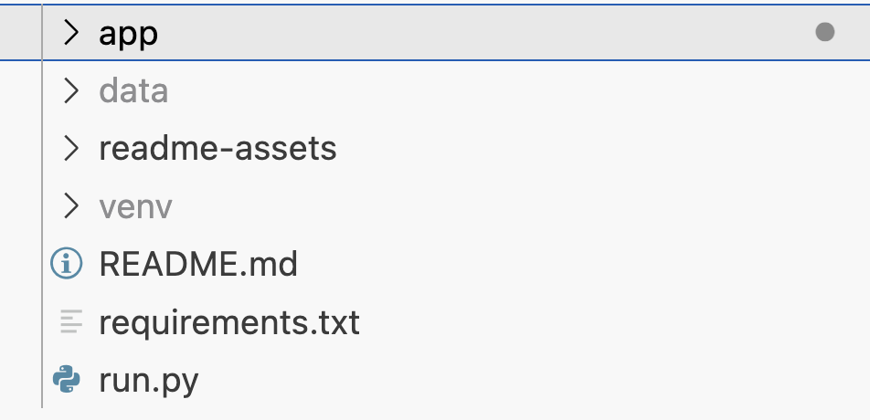
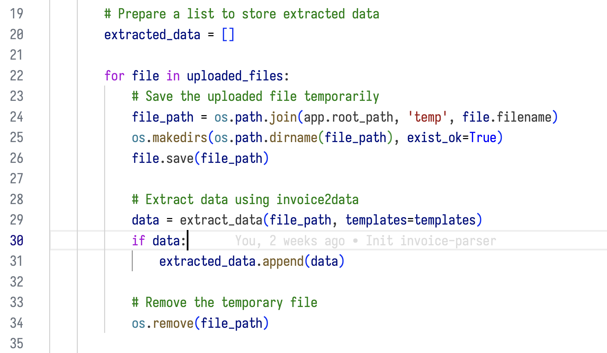
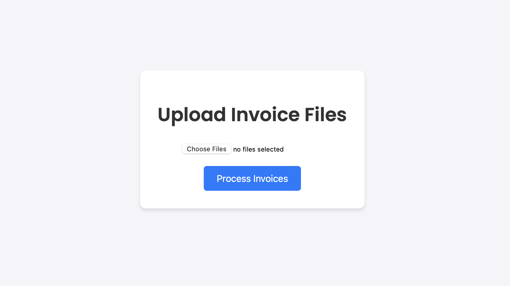
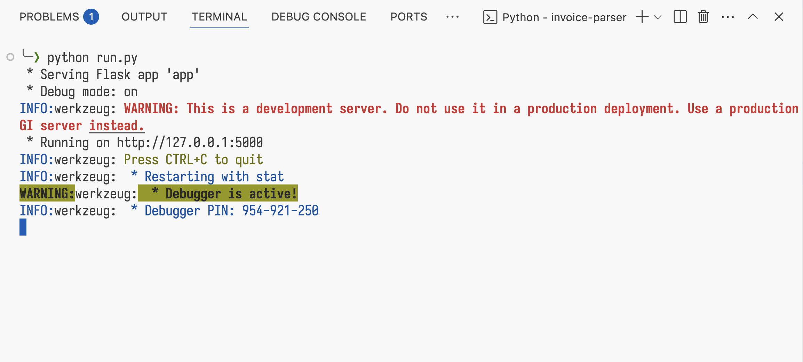

# A Taste of Flask

We recently built a PDF parser using Flask—you'll be surprised by how simple the process was. In this post, we walk you through our intro project build process: **invoice-parser**.

Demo video:

<iframe width="560" height="315" src="https://www.youtube.com/embed/qHFbuiNJJdI?si=VEhZAwD8hFtvaXkt" title="YouTube video player" frameborder="0" allow="accelerometer; autoplay; clipboard-write; encrypted-media; gyroscope; picture-in-picture; web-share" referrerpolicy="strict-origin-when-cross-origin" allowfullscreen></iframe>

## 1. The Application 🧾

The goal of the app was to simplify the process of recording invoice data.

We wanted to take in scanned PDF invoices, extract relevant information (like invoice number, date, and total), and export that data into a clean CSV file. The result? Less manual data entry, and more automation.

## 2. The Tech Stack ⚙️

Here are the various libraries involved:

-   **Flask** – The focus of this blog - A popular Python web development framework.
-   **invoice2data** – A Python package for extracting structured information from PDFs.
-   **HTML5** – To build the user interface and allow file uploads.

## 3. How’d It Go? ✅

Here’s how we built it, step by step:

1.  Prompted AI agents to scaffold a basic Flask application.

2.  Plugged in `invoice2data` to handle the PDF processing logic.

3.  Prompted the AI agent again to clean up the front end, giving the UI a simple but polished feel.

4.  Once everything was in place, all we needed to do was run `python main.py`—and boom! We had a working local web app.

The whole process was quick, intuitive, and a great demonstration of how accessible web development in Python using Flask can be.

## Questions?

Contact us below! We’re happy to discuss all things software. Follow us on [LinkedIn](https://www.linkedin.com/company/aspirecodingacademy/) for updates on new blog posts.
